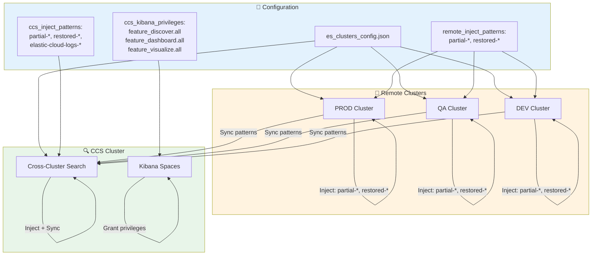
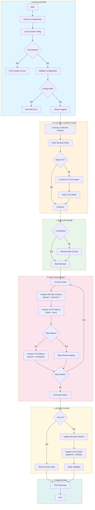
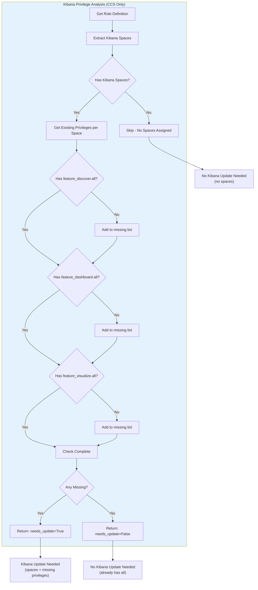
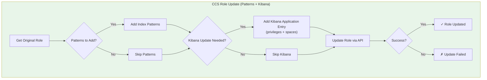
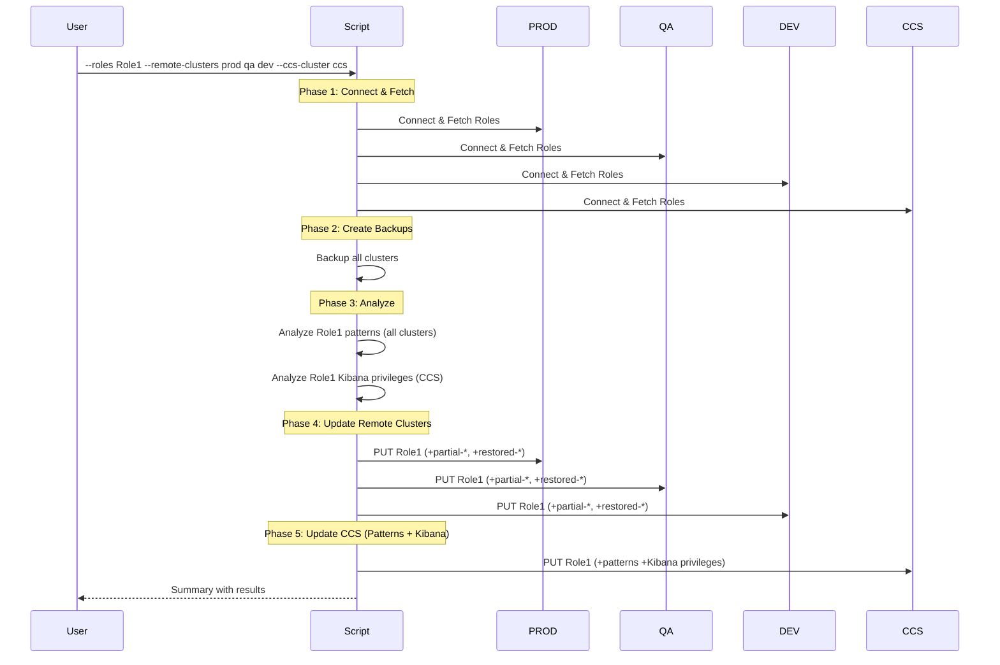
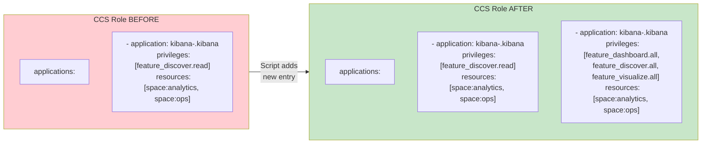

# Workflow Diagram: Elasticsearch Role Auto-Updater (Multi-Cluster)

## High-Level Architecture



## Summary Tables

### What Gets Updated

| Cluster Type | Index Patterns | Kibana Privileges |
|--------------|----------------|-------------------|
| **Remote** (prod, qa, dev) | `partial-*`, `restored-*` | None |
| **CCS** | `partial-*`, `restored-*`, `elastic-cloud-logs-*` + synced | `feature_discover.all`, `feature_dashboard.all`, `feature_visualize.all` |

## Main Execution Flow



## Kibana Privilege Analysis Flow



## CCS Role Update Flow (Combined)



## Multi-Cluster Update Sequence



## Kibana Privilege Example



---

## ASCII Flowchart (For Terminal/Plain Text)

```
┌─────────────────────────────────────────────────────────────────────────┐
│                              START                                       │
└─────────────────────────────────────────────────────────────────────────┘
                                   │
                                   ▼
┌─────────────────────────────────────────────────────────────────────────┐
│  INITIALIZATION                                                          │
│  ├── Parse CLI arguments                                                │
│  ├── Load cluster config                                                │
│  ├── Load inject patterns (remote vs CCS)                               │
│  ├── Load Kibana privileges                                             │
│  └── Setup logging                                                      │
└─────────────────────────────────────────────────────────────────────────┘
                                   │
                                   ▼
┌─────────────────────────────────────────────────────────────────────────┐
│  CONNECT TO ALL CLUSTERS                                                 │
│  ├── Connect to each remote cluster (prod, qa, dev)                     │
│  ├── Fetch all roles from each remote                                   │
│  ├── Connect to CCS cluster                                             │
│  └── Fetch all roles from CCS                                           │
└─────────────────────────────────────────────────────────────────────────┘
                                   │
                                   ▼
┌─────────────────────────────────────────────────────────────────────────┐
│  CREATE BACKUPS (per cluster)                                            │
└─────────────────────────────────────────────────────────────────────────┘
                                   │
                                   ▼
┌─────────────────────────────────────────────────────────────────────────┐
│  ANALYZE EACH ROLE                                                       │
│  ┌────────────────────────────────────────────────────────────────────┐ │
│  │  FOR EACH ROLE:                                                    │ │
│  │  ├── REMOTE CLUSTER ANALYSIS:                                      │ │
│  │  │   └── Check for partial-*, restored-*                           │ │
│  │  │                                                                 │ │
│  │  ├── CCS PATTERN ANALYSIS:                                         │ │
│  │  │   ├── Check CCS inject patterns                                 │ │
│  │  │   └── Sync patterns from all remotes                            │ │
│  │  │                                                                 │ │
│  │  └── CCS KIBANA ANALYSIS:                                          │ │
│  │      ├── Extract existing Kibana spaces                            │ │
│  │      ├── Check for feature_discover.all                            │ │
│  │      ├── Check for feature_dashboard.all                           │ │
│  │      └── Check for feature_visualize.all                           │ │
│  └────────────────────────────────────────────────────────────────────┘ │
└─────────────────────────────────────────────────────────────────────────┘
                                   │
                    ┌───────────────────────────┐
                    │  --dry-run?               │
                    └───────────────────────────┘
                           │              │
                       YES │              │ NO
                           ▼              ▼
             ┌──────────────────┐  ┌──────────────────────────────────────┐
             │ Show Preview     │  │  APPLY UPDATES                       │
             │ Only             │  │  ├── Update PROD roles               │
             └──────────────────┘  │  ├── Update QA roles                 │
                           │       │  ├── Update DEV roles                │
                           │       │  └── Update CCS roles:               │
                           │       │      ├── Add patterns                │
                           │       │      └── Add Kibana privileges       │
                           │       └──────────────────────────────────────┘
                           │              │
                           ▼              ▼
┌─────────────────────────────────────────────────────────────────────────┐
│  PRINT SUMMARY                                                           │
│  ├── PROD:  X roles updated (partial-*, restored-*)                     │
│  ├── QA:    X roles updated (partial-*, restored-*)                     │
│  ├── DEV:   X roles updated (partial-*, restored-*)                     │
│  └── CCS:   X roles updated                                             │
│             ├── Patterns: [INJ:3, PROD:1, QA:2, DEV:1]                  │
│             └── Kibana: +privileges for N spaces                        │
└─────────────────────────────────────────────────────────────────────────┘
                                   │
                                   ▼
┌─────────────────────────────────────────────────────────────────────────┐
│                                END                                       │
└─────────────────────────────────────────────────────────────────────────┘
```

---

## Kibana Privileges Deep Dive (ASCII)

```
BEFORE UPDATE                              AFTER UPDATE
═════════════                              ════════════

CCS Role: ELK-Analytics-Role               CCS Role: ELK-Analytics-Role
┌────────────────────────────────┐         ┌────────────────────────────────┐
│ applications:                  │         │ applications:                  │
│ ┌────────────────────────────┐ │         │ ┌────────────────────────────┐ │
│ │ application: kibana-.kibana│ │         │ │ application: kibana-.kibana│ │
│ │ privileges:                │ │         │ │ privileges:                │ │
│ │   - feature_discover.read  │ │         │ │   - feature_discover.read  │ │
│ │   - feature_dashboard.read │ │         │ │   - feature_dashboard.read │ │
│ │ resources:                 │ │         │ │ resources:                 │ │
│ │   - space:analytics        │ │         │ │   - space:analytics        │ │
│ │   - space:operations       │ │         │ │   - space:operations       │ │
│ └────────────────────────────┘ │         │ └────────────────────────────┘ │
│                                │         │ ┌────────────────────────────┐ │
│                                │   ──►   │ │ application: kibana-.kibana│ │
│                                │  ADD    │ │ privileges:                │ │
│                                │  NEW    │ │   - feature_dashboard.all  │◄── NEW
│                                │ ENTRY   │ │   - feature_discover.all   │◄── NEW
│                                │         │ │   - feature_visualize.all  │◄── NEW
│                                │         │ │ resources:                 │ │
│                                │         │ │   - space:analytics        │ │
│                                │         │ │   - space:operations       │ │
│                                │         │ └────────────────────────────┘ │
└────────────────────────────────┘         └────────────────────────────────┘

RESULT: Role now has full Discover, Dashboard, and Visualize access
        for spaces: analytics, operations
        
        Users can now:
        ✓ Generate CSV reports from Discover
        ✓ Generate PDF/PNG reports from Dashboard
        ✓ Full Visualize editing capabilities
```

---

## Decision Tree: Kibana Privilege Update

```
                    ┌─────────────────────────┐
                    │ Analyze CCS Role        │
                    │ for Kibana Privileges   │
                    └───────────┬─────────────┘
                                │
                                ▼
                    ┌─────────────────────────┐
                    │ Does role have any      │
                    │ Kibana spaces assigned? │
                    └───────────┬─────────────┘
                                │
                    ┌───────────┴───────────┐
                    │                       │
                   NO                      YES
                    │                       │
                    ▼                       ▼
        ┌───────────────────┐   ┌─────────────────────────┐
        │ SKIP              │   │ Extract all spaces      │
        │ No spaces to      │   │ (space:analytics, etc.) │
        │ grant privileges  │   └───────────┬─────────────┘
        └───────────────────┘               │
                                            ▼
                                ┌─────────────────────────┐
                                │ For each required priv: │
                                │ - feature_discover.all  │
                                │ - feature_dashboard.all │
                                │ - feature_visualize.all │
                                └───────────┬─────────────┘
                                            │
                                            ▼
                                ┌─────────────────────────┐
                                │ Check: Does role have   │
                                │ privilege for ALL spaces│
                                └───────────┬─────────────┘
                                            │
                                ┌───────────┴───────────┐
                                │                       │
                         ALL PRESENT             SOME MISSING
                                │                       │
                                ▼                       ▼
                    ┌───────────────────┐   ┌─────────────────────────┐
                    │ SKIP              │   │ ADD NEW APPLICATION     │
                    │ Already has all   │   │ ENTRY with:             │
                    │ required privs    │   │ - All 3 privileges      │
                    └───────────────────┘   │ - All existing spaces   │
                                            └─────────────────────────┘
```

---

## Summary Table

| Phase | Remote Clusters | CCS Cluster |
|-------|-----------------|-------------|
| **Connect** | Each remote individually | CCS cluster |
| **Backup** | Per-cluster backup | CCS backup |
| **Analyze Patterns** | Check for 2 patterns | Check for 3 patterns + sync |
| **Analyze Kibana** | N/A | Check for 3 privileges per space |
| **Update Patterns** | Add missing (max 2) | Add all missing (tagged by source) |
| **Update Kibana** | N/A | Add new application entry |
| **Report** | Per-cluster results | Patterns + Kibana updates |
