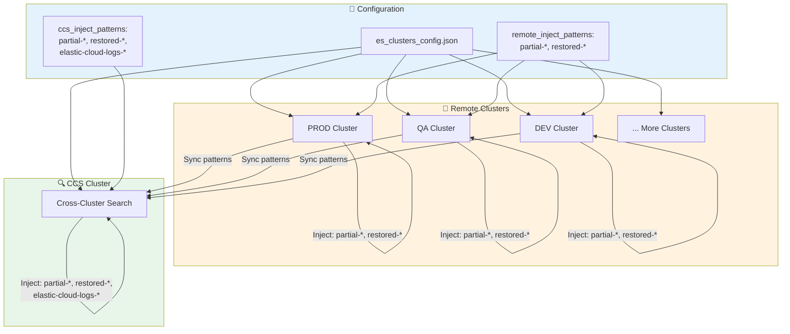
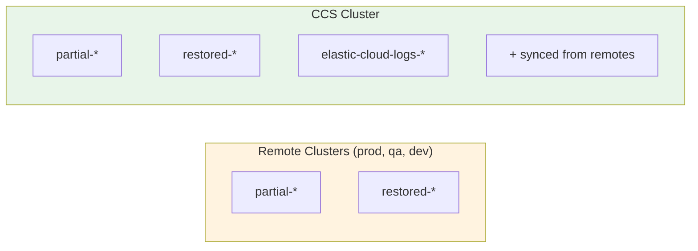
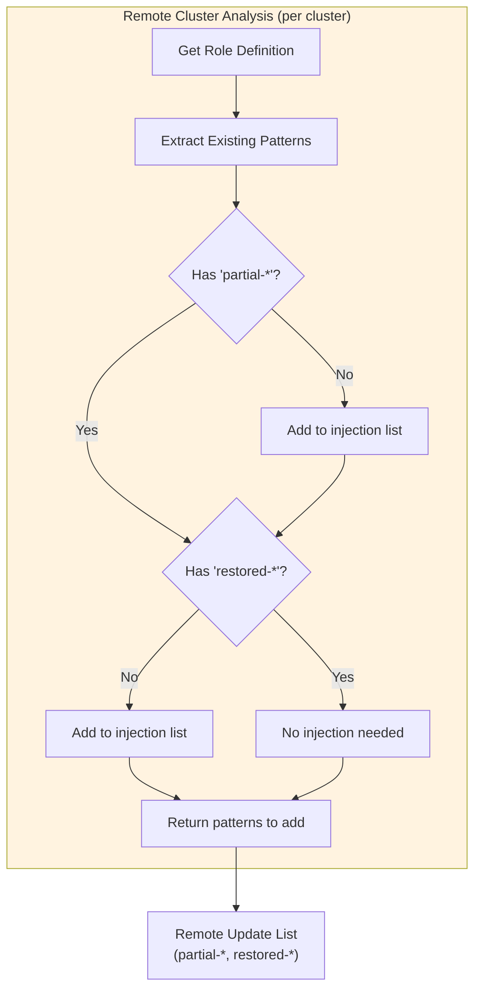
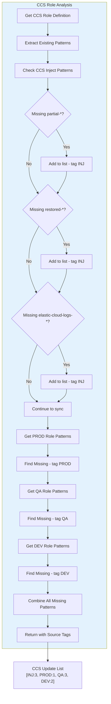
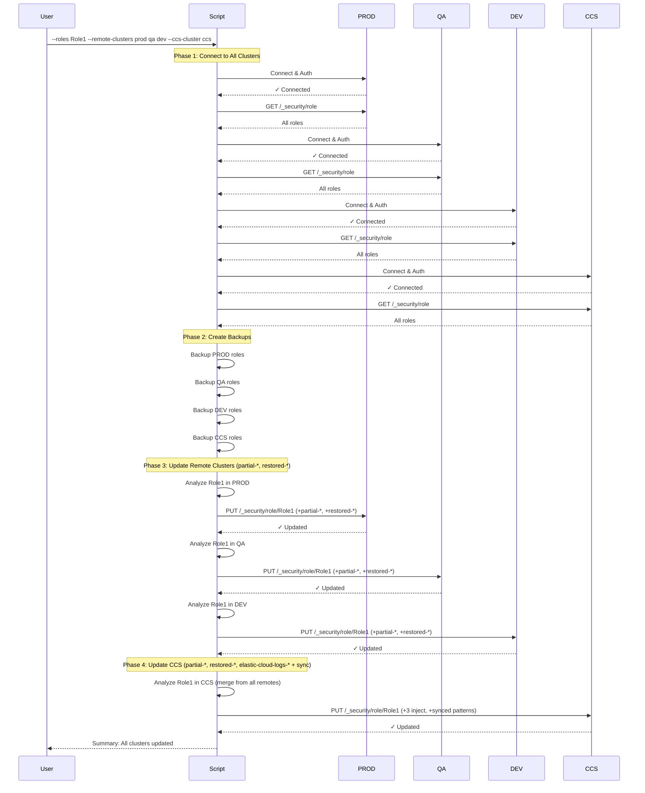
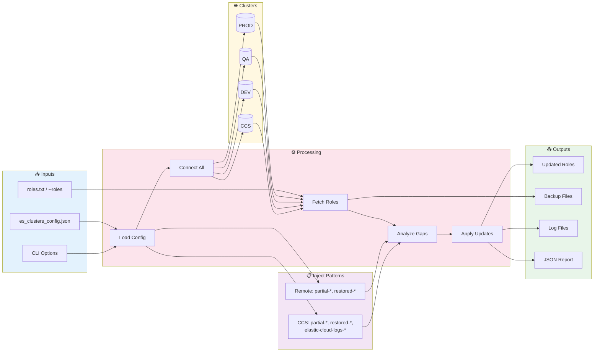
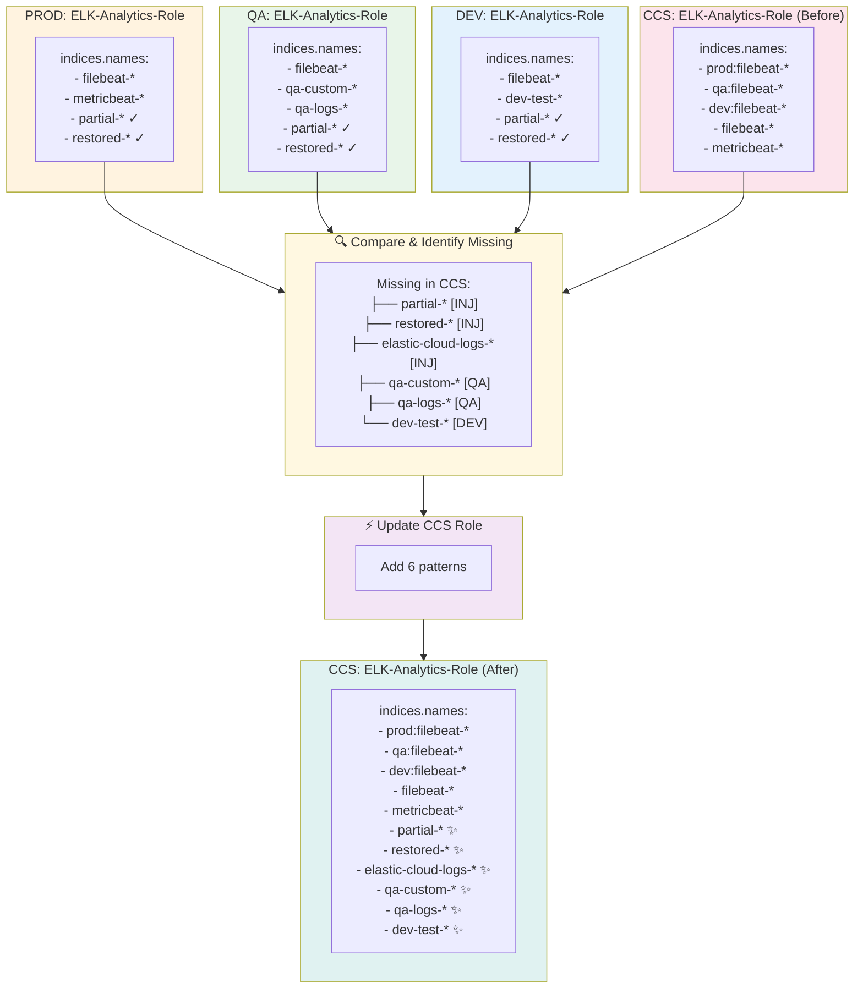
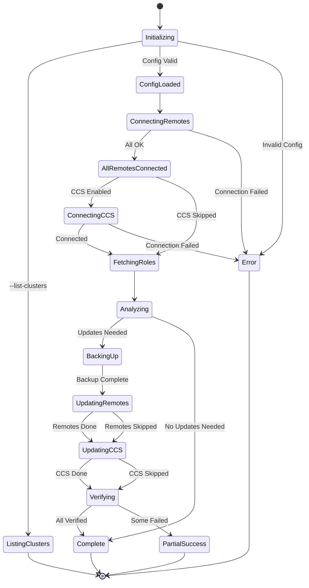
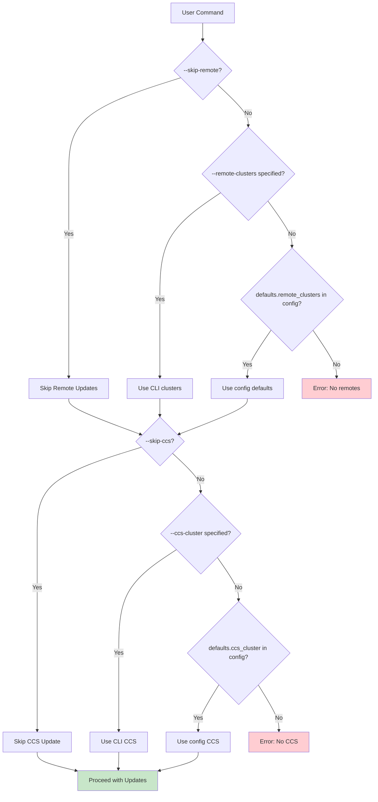

# Workflow Diagram: Elasticsearch Role Auto-Updater (Multi-Cluster)

## High-Level Architecture



## Inject Patterns Summary



## Main Execution Flow

```mermaid
flowchart TD
    subgraph INIT["🚀 INITIALIZATION"]
        A[Start] --> B[Parse CLI Arguments]
        B --> C[Load Cluster Config]
        C --> D{--list-clusters?}
        D -->|Yes| E[Print Clusters & Exit]
        D -->|No| F[Validate Configuration]
        F --> G{Config Valid?}
        G -->|No| H[Exit with Error]
        G -->|Yes| I[Setup Logging]
    end

    subgraph ROLES["📋 ROLE SELECTION"]
        I --> J{Role Source?}
        J -->|--roles| K[Use CLI Role List]
        J -->|--role-file| L[Load from File]
        J -->|--all-matching| M[Find Common Roles]
        K --> N[Validate Role Names]
        L --> N
        M --> N
    end

    subgraph CONNECT["🔌 CLUSTER CONNECTIONS"]
        N --> O[For Each Remote Cluster]
        O --> P[Connect & Authenticate]
        P --> Q[Fetch All Roles]
        Q --> R{More Remote Clusters?}
        R -->|Yes| O
        R -->|No| S{Skip CCS?}
        S -->|No| T[Connect to CCS Cluster]
        T --> U[Fetch CCS Roles]
        S -->|Yes| V[Continue]
        U --> V
    end

    subgraph BACKUP["💾 BACKUP PHASE"]
        V --> W{--no-backup?}
        W -->|Yes| X[Skip Backups]
        W -->|No| Y[Backup Each Cluster]
        Y --> X
    end

    subgraph ANALYZE["🔍 ANALYSIS PHASE"]
        X --> Z[For Each Role]
        Z --> AA["Analyze Remote Clusters<br/>(partial-*, restored-*)"]
        AA --> AB["Analyze CCS Cluster<br/>(partial-*, restored-*,<br/>elastic-cloud-logs-* + sync)"]
        AB --> AC{More Roles?}
        AC -->|Yes| Z
        AC -->|No| AD[Generate Report]
    end

    subgraph UPDATE["⚡ UPDATE PHASE"]
        AD --> AE{--dry-run?}
        AE -->|Yes| AF[Show Preview Only]
        AE -->|No| AG[Update Remote Clusters]
        AG --> AH[Update CCS Cluster]
        AH --> AI[Verify Updates]
    end

    subgraph FINISH["✅ COMPLETION"]
        AF --> AJ[Print Summary]
        AI --> AJ
        AJ --> AK[Exit]
    end

    style INIT fill:#e1f5fe
    style ROLES fill:#f3e5f5
    style CONNECT fill:#fff3e0
    style BACKUP fill:#e8f5e9
    style ANALYZE fill:#fce4ec
    style UPDATE fill:#fff8e1
    style FINISH fill:#e0f2f1
```



## Remote Cluster Analysis Flow



## CCS Analysis Flow (Multi-Source Sync)



## Multi-Cluster Update Sequence



## Data Flow Diagram



## Pattern Sync Logic (Multi-Source)



## State Diagram



## Decision Tree: Cluster Selection



---

## ASCII Flowchart (For Terminal/Plain Text)

```
┌─────────────────────────────────────────────────────────────────────────┐
│                              START                                       │
└─────────────────────────────────────────────────────────────────────────┘
                                   │
                                   ▼
┌─────────────────────────────────────────────────────────────────────────┐
│  INITIALIZATION                                                          │
│  ├── Parse CLI arguments                                                │
│  ├── Load cluster config (es_clusters_config.json)                      │
│  ├── Load inject patterns:                                              │
│  │   ├── Remote: partial-*, restored-*                                  │
│  │   └── CCS: partial-*, restored-*, elastic-cloud-logs-*               │
│  └── Setup logging                                                      │
└─────────────────────────────────────────────────────────────────────────┘
                                   │
                        ┌──────────┴──────────┐
                        ▼                     ▼
              ┌──────────────────┐   ┌────────────────────────┐
              │  --list-clusters │   │  Continue with update  │
              │  Print & Exit    │   │                        │
              └──────────────────┘   └────────────────────────┘
                                              │
                                              ▼
┌─────────────────────────────────────────────────────────────────────────┐
│  ROLE SELECTION                                                          │
│  ├── Option A: --roles Role1 Role2 (from CLI)                           │
│  ├── Option B: --role-file roles.txt (from file)                        │
│  └── Option C: --all-matching (find common roles across all clusters)   │
└─────────────────────────────────────────────────────────────────────────┘
                                   │
                                   ▼
┌─────────────────────────────────────────────────────────────────────────┐
│  CONNECT TO ALL CLUSTERS                                                 │
│  ┌────────────────────────────────────────────────────────────────────┐ │
│  │  FOR EACH REMOTE CLUSTER (prod, qa, dev, ...):                     │ │
│  │  ├── Connect and authenticate                                      │ │
│  │  ├── Fetch all roles                                               │ │
│  │  └── Store in memory                                               │ │
│  └────────────────────────────────────────────────────────────────────┘ │
│  ┌────────────────────────────────────────────────────────────────────┐ │
│  │  FOR CCS CLUSTER (if not --skip-ccs):                              │ │
│  │  ├── Connect and authenticate                                      │ │
│  │  └── Fetch all roles                                               │ │
│  └────────────────────────────────────────────────────────────────────┘ │
└─────────────────────────────────────────────────────────────────────────┘
                                   │
                                   ▼
┌─────────────────────────────────────────────────────────────────────────┐
│  CREATE BACKUPS (unless --no-backup)                                     │
│  ├── ./backups/prod/roles_backup_TIMESTAMP.json                         │
│  ├── ./backups/qa/roles_backup_TIMESTAMP.json                           │
│  ├── ./backups/dev/roles_backup_TIMESTAMP.json                          │
│  └── ./backups/ccs/roles_backup_TIMESTAMP.json                          │
└─────────────────────────────────────────────────────────────────────────┘
                                   │
                                   ▼
┌─────────────────────────────────────────────────────────────────────────┐
│  ANALYZE EACH ROLE                                                       │
│  ┌────────────────────────────────────────────────────────────────────┐ │
│  │  FOR EACH ROLE:                                                    │ │
│  │  ├── REMOTE CLUSTER ANALYSIS (prod, qa, dev):                      │ │
│  │  │   └── Check for partial-*, restored-*                           │ │
│  │  │       └── If missing → Add to cluster's update list             │ │
│  │  │                                                                 │ │
│  │  └── CCS CLUSTER ANALYSIS:                                         │ │
│  │      ├── Check for partial-*, restored-*, elastic-cloud-logs-*     │ │
│  │      │   └── If missing → Add to list [tag: INJ]                   │ │
│  │      ├── Compare with PROD patterns                                │ │
│  │      │   └── If missing → Add to list [tag: PROD]                  │ │
│  │      ├── Compare with QA patterns                                  │ │
│  │      │   └── If missing → Add to list [tag: QA]                    │ │
│  │      └── Compare with DEV patterns                                 │ │
│  │          └── If missing → Add to list [tag: DEV]                   │ │
│  └────────────────────────────────────────────────────────────────────┘ │
└─────────────────────────────────────────────────────────────────────────┘
                                   │
                                   ▼
                    ┌───────────────────────────┐
                    │  --dry-run or             │
                    │  --report-only?           │
                    └───────────────────────────┘
                           │              │
                       YES │              │ NO
                           ▼              ▼
             ┌──────────────────┐  ┌──────────────────────────────────────┐
             │ Show Preview     │  │  APPLY UPDATES                       │
             │ Only             │  │  ├── Update PROD roles (+2 patterns) │
             └──────────────────┘  │  ├── Update QA roles (+2 patterns)   │
                           │       │  ├── Update DEV roles (+2 patterns)  │
                           │       │  └── Update CCS roles (+3 + synced)  │
                           │       └──────────────────────────────────────┘
                           │              │
                           ▼              ▼
┌─────────────────────────────────────────────────────────────────────────┐
│  GENERATE OUTPUTS                                                        │
│  ├── ./logs/role_auto_update_TIMESTAMP.log                              │
│  └── ./logs/role_update_report_TIMESTAMP.json                           │
└─────────────────────────────────────────────────────────────────────────┘
                                   │
                                   ▼
┌─────────────────────────────────────────────────────────────────────────┐
│  PRINT SUMMARY                                                           │
│  ├── PROD:  X roles updated (partial-*, restored-*)                     │
│  ├── QA:    X roles updated (partial-*, restored-*)                     │
│  ├── DEV:   X roles updated (partial-*, restored-*)                     │
│  └── CCS:   X roles updated                                             │
│             [INJ:3, PROD:1, QA:3, DEV:2]                                │
│             (partial-*, restored-*, elastic-cloud-logs-* + synced)      │
└─────────────────────────────────────────────────────────────────────────┘
                                   │
                                   ▼
┌─────────────────────────────────────────────────────────────────────────┐
│                                END                                       │
│  Exit Code: 0 (all success) or 1 (some failures)                        │
└─────────────────────────────────────────────────────────────────────────┘
```

---

## Multi-Cluster Pattern Sync (ASCII)

```
REMOTE CLUSTERS                                      CCS CLUSTER
═══════════════                                      ═══════════

PROD Role                    
┌────────────────────┐       
│ Inject:            │       
│  + partial-*       │       
│  + restored-*      │       
│                    │       
│ indices.names:     │       
│  - filebeat-*      │       
│  - metricbeat-*    │───────┐
│  - partial-*  ✓    │       │
│  - restored-* ✓    │       │
└────────────────────┘       │
                             │
QA Role                      │
┌────────────────────┐       │
│ Inject:            │       │
│  + partial-*       │       │
│  + restored-*      │       │
│                    │       │
│ indices.names:     │       │
│  - filebeat-*      │       │
│  - qa-custom-*     │───────┼──────► CCS Role
│  - qa-logs-*       │       │        ┌────────────────────────────┐
│  - partial-*  ✓    │       │        │ Inject:                    │
│  - restored-* ✓    │       │        │  + partial-*               │
└────────────────────┘       │        │  + restored-*              │
                             │        │  + elastic-cloud-logs-*    │
DEV Role                     │        │                            │
┌────────────────────┐       │        │ Sync from remotes:         │
│ Inject:            │       │        │  + metricbeat-* [PROD]     │
│  + partial-*       │       │        │  + qa-custom-* [QA]        │
│  + restored-*      │       │        │  + qa-logs-* [QA]          │
│                    │       │        │  + dev-test-* [DEV]        │
│ indices.names:     │       │        │                            │
│  - filebeat-*      │       │        │ indices.names (AFTER):     │
│  - dev-test-*      │───────┘        │  - prod:filebeat-*         │
│  - partial-*  ✓    │                │  - qa:filebeat-*           │
│  - restored-* ✓    │                │  - dev:filebeat-*          │
└────────────────────┘                │  - filebeat-*              │
                                      │  - metricbeat-*      ✨    │
                                      │  - partial-*         ✨    │
                                      │  - restored-*        ✨    │
                                      │  - elastic-cloud-logs-* ✨ │
                                      │  - qa-custom-*       ✨    │
                                      │  - qa-logs-*         ✨    │
                                      │  - dev-test-*        ✨    │
                                      └────────────────────────────┘

Summary: Remote clusters get 2 patterns each
         CCS gets 3 inject patterns + synced patterns from all remotes
```

---

## Viewing These Diagrams

These diagrams use [Mermaid](https://mermaid.js.org/) syntax and can be viewed in:

- **GitHub/GitLab**: Renders automatically in markdown files
- **VS Code**: Install "Markdown Preview Mermaid Support" extension
- **Online**: Paste into [Mermaid Live Editor](https://mermaid.live)
- **Documentation tools**: Notion, Confluence, Obsidian support Mermaid

---

## Summary Table

| Cluster Type | Inject Patterns | Sync From |
|--------------|-----------------|-----------|
| **Remote** (prod, qa, dev) | `partial-*`, `restored-*` | N/A |
| **CCS** | `partial-*`, `restored-*`, `elastic-cloud-logs-*` | All remote clusters |

| Phase | Remote Clusters | CCS Cluster |
|-------|-----------------|-------------|
| Connect | Each remote individually | CCS cluster |
| Backup | Per-cluster backup | CCS backup |
| Analyze | Check for 2 patterns | Check for 3 patterns + sync from remotes |
| Update | Add missing (max 2) | Add all missing (tagged by source) |
| Report | Per-cluster results | Aggregated with source tags |
