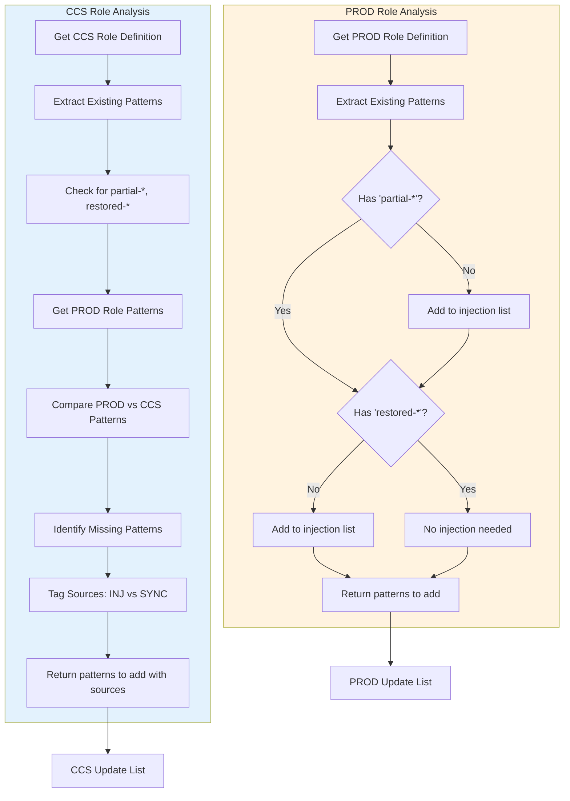
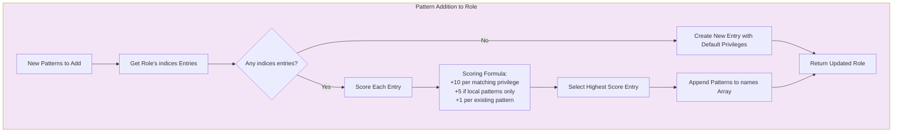
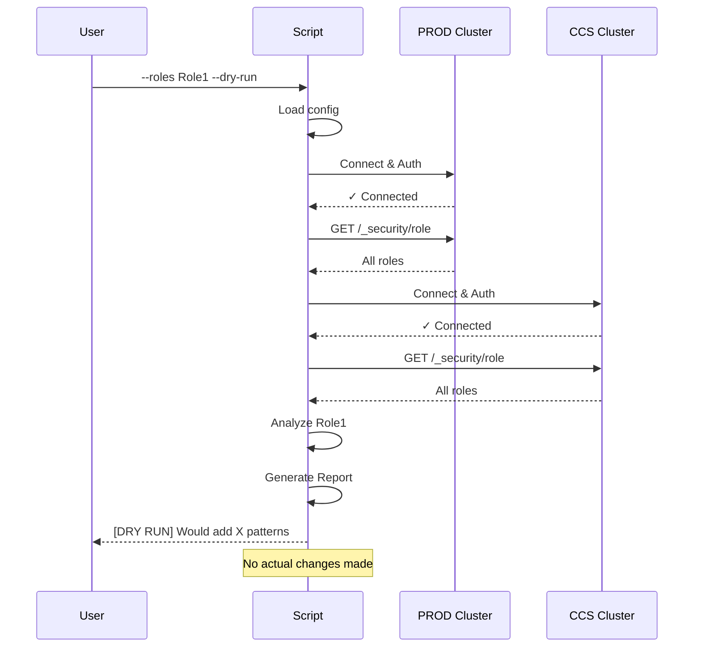
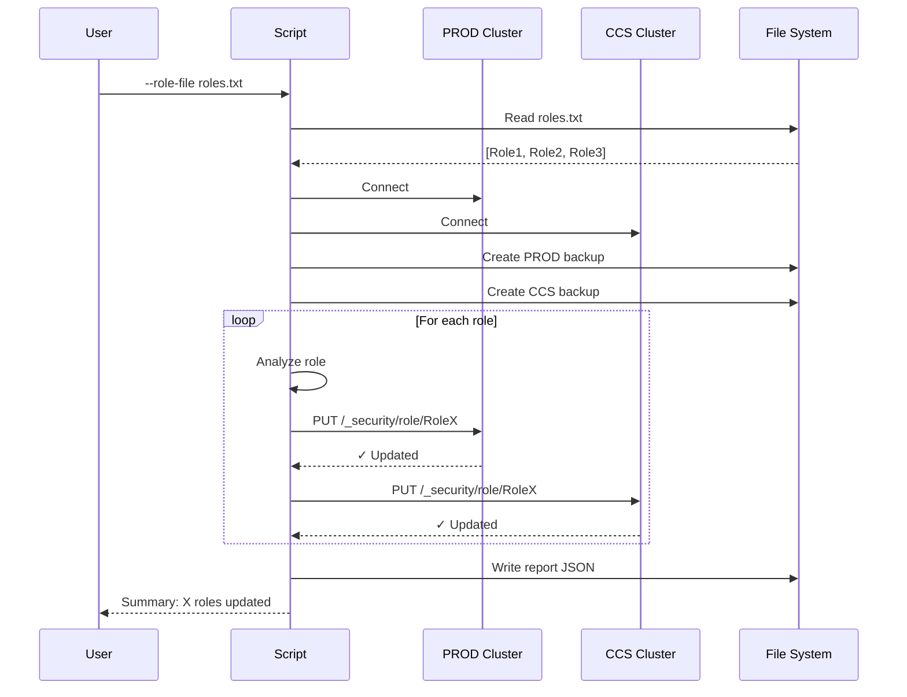
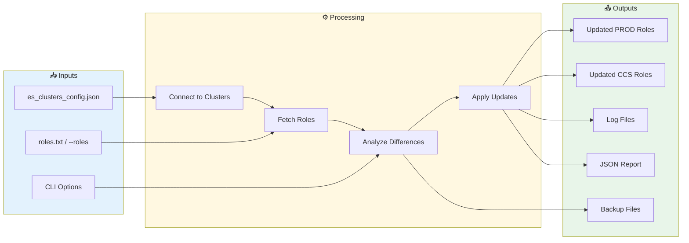
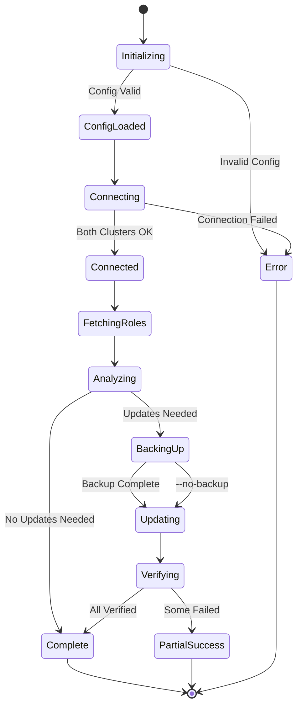

# Workflow Diagram: Elasticsearch Role Auto-Updater

## High-Level Workflow

```mermaid
flowchart TD
    subgraph INIT["🚀 INITIALIZATION"]
        A[Start] --> B[Parse CLI Arguments]
        B --> C[Load Cluster Config]
        C --> D{Config Valid?}
        D -->|No| E[Exit with Error]
        D -->|Yes| F[Setup Logging]
    end

    subgraph ROLES["📋 ROLE SELECTION"]
        F --> G{Role Source?}
        G -->|--roles| H[Use CLI Role List]
        G -->|--role-file| I[Load from File]
        G -->|--all-matching| J[Find Common Roles]
        H --> K[Validate Role Names]
        I --> K
        J --> K
    end

    subgraph CONNECT["🔌 CLUSTER CONNECTIONS"]
        K --> L[Connect to PROD Cluster]
        L --> M{PROD Connected?}
        M -->|No| E
        M -->|Yes| N[Fetch All PROD Roles]
        N --> O[Connect to CCS Cluster]
        O --> P{CCS Connected?}
        P -->|No| E
        P -->|Yes| Q[Fetch All CCS Roles]
    end

    subgraph BACKUP["💾 BACKUP PHASE"]
        Q --> R{--no-backup?}
        R -->|Yes| S[Skip Backups]
        R -->|No| T[Backup PROD Roles]
        T --> U[Backup CCS Roles]
        U --> S
    end

    subgraph ANALYZE["🔍 ANALYSIS PHASE"]
        S --> V[For Each Role]
        V --> W[Analyze PROD Role]
        W --> X{Missing partial-* or restored-*?}
        X -->|Yes| Y[Mark for PROD Update]
        X -->|No| Z[PROD OK]
        Y --> AA[Analyze CCS Role]
        Z --> AA
        AA --> AB{Missing Patterns?}
        AB -->|Yes| AC[Mark for CCS Update]
        AB -->|No| AD[CCS OK]
        AC --> AE{More Roles?}
        AD --> AE
        AE -->|Yes| V
        AE -->|No| AF[Generate Report]
    end

    subgraph UPDATE["⚡ UPDATE PHASE"]
        AF --> AG{--dry-run or --report-only?}
        AG -->|Yes| AH[Show Preview Only]
        AG -->|No| AI[Update PROD Roles]
        AI --> AJ[Update CCS Roles]
        AJ --> AK[Verify Updates]
    end

    subgraph FINISH["✅ COMPLETION"]
        AH --> AL[Print Summary]
        AK --> AL
        AL --> AM[Exit]
    end

    style INIT fill:#e1f5fe
    style ROLES fill:#f3e5f5
    style CONNECT fill:#fff3e0
    style BACKUP fill:#e8f5e9
    style ANALYZE fill:#fce4ec
    style UPDATE fill:#fff8e1
    style FINISH fill:#e0f2f1
```



## Detailed Analysis Flow



## Pattern Addition Strategy



## Command Flow Examples

### Example 1: Dry Run with Specific Roles



### Example 2: Full Update



## Data Flow



## State Diagram



---

## Viewing These Diagrams

These diagrams use [Mermaid](https://mermaid.js.org/) syntax and can be viewed in:

- **GitHub/GitLab**: Renders automatically in markdown files
- **VS Code**: Install "Markdown Preview Mermaid Support" extension
- **Online**: Paste into [Mermaid Live Editor](https://mermaid.live)
- **Documentation tools**: Notion, Confluence, Obsidian support Mermaid

---

## ASCII Flowchart (For Terminal/Plain Text)

```
┌─────────────────────────────────────────────────────────────────┐
│                         START                                    │
└─────────────────────────────────────────────────────────────────┘
                              │
                              ▼
┌─────────────────────────────────────────────────────────────────┐
│  INITIALIZATION                                                  │
│  ├── Parse CLI arguments                                        │
│  ├── Load cluster config (es_clusters_config.json)              │
│  └── Setup logging                                              │
└─────────────────────────────────────────────────────────────────┘
                              │
                              ▼
┌─────────────────────────────────────────────────────────────────┐
│  ROLE SELECTION                                                  │
│  ├── Option A: --roles Role1 Role2 (from CLI)                   │
│  ├── Option B: --role-file roles.txt (from file)                │
│  └── Option C: --all-matching (find common roles)               │
└─────────────────────────────────────────────────────────────────┘
                              │
                              ▼
┌─────────────────────────────────────────────────────────────────┐
│  CONNECT TO CLUSTERS                                             │
│  ├── Connect to PROD cluster ──► Fetch all roles                │
│  └── Connect to CCS cluster  ──► Fetch all roles                │
└─────────────────────────────────────────────────────────────────┘
                              │
                              ▼
┌─────────────────────────────────────────────────────────────────┐
│  CREATE BACKUPS (unless --no-backup)                             │
│  ├── ./backups/prod/roles_backup_TIMESTAMP.json                 │
│  └── ./backups/ccs/roles_backup_TIMESTAMP.json                  │
└─────────────────────────────────────────────────────────────────┘
                              │
                              ▼
┌─────────────────────────────────────────────────────────────────┐
│  ANALYZE EACH ROLE                                               │
│  ┌────────────────────────────────────────────────────────────┐ │
│  │  FOR EACH ROLE:                                            │ │
│  │  ├── PROD Analysis:                                        │ │
│  │  │   └── Check for partial-*, restored-*                   │ │
│  │  │       └── If missing → Add to PROD update list          │ │
│  │  │                                                         │ │
│  │  └── CCS Analysis:                                         │ │
│  │      ├── Check for partial-*, restored-*                   │ │
│  │      │   └── If missing → Add to CCS update list [INJ]     │ │
│  │      └── Compare with PROD patterns                        │ │
│  │          └── If missing → Add to CCS update list [SYNC]    │ │
│  └────────────────────────────────────────────────────────────┘ │
└─────────────────────────────────────────────────────────────────┘
                              │
                              ▼
                    ┌─────────────────┐
                    │  --dry-run or   │
                    │  --report-only? │
                    └─────────────────┘
                     │              │
                 YES │              │ NO
                     ▼              ▼
         ┌──────────────┐  ┌──────────────────────────────────────┐
         │ Show Preview │  │  APPLY UPDATES                       │
         │ Only         │  │  ├── Update PROD roles               │
         └──────────────┘  │  │   └── PUT /_security/role/{name}  │
                     │     │  └── Update CCS roles                │
                     │     │      └── PUT /_security/role/{name}  │
                     │     └──────────────────────────────────────┘
                     │              │
                     ▼              ▼
┌─────────────────────────────────────────────────────────────────┐
│  GENERATE OUTPUTS                                                │
│  ├── ./logs/role_auto_update_TIMESTAMP.log                      │
│  └── ./logs/role_update_report_TIMESTAMP.json                   │
└─────────────────────────────────────────────────────────────────┘
                              │
                              ▼
┌─────────────────────────────────────────────────────────────────┐
│  PRINT SUMMARY                                                   │
│  ├── PROD: X roles updated (Y successful, Z failed)             │
│  └── CCS:  X roles updated (Y successful, Z failed)             │
└─────────────────────────────────────────────────────────────────┘
                              │
                              ▼
┌─────────────────────────────────────────────────────────────────┐
│                          END                                     │
│  Exit Code: 0 (success) or 1 (failures occurred)                │
└─────────────────────────────────────────────────────────────────┘
```

---

## Pattern Sync Logic (ASCII)

```
PROD Role: ELK-Analytics-Role          CCS Role: ELK-Analytics-Role
┌─────────────────────────────┐        ┌─────────────────────────────┐
│ indices:                    │        │ indices:                    │
│   - names:                  │        │   - names:                  │
│       - filebeat-*          │        │       - prod:filebeat-*     │
│       - metricbeat-*        │        │       - prod:metricbeat-*   │
│       - partial-*      ✓    │        │       - filebeat-*          │
│       - restored-*     ✓    │        │       - metricbeat-*        │
│       - auditbeat-*         │        │                             │
└─────────────────────────────┘        └─────────────────────────────┘
              │                                      │
              │         ┌──────────────┐             │
              └────────►│   COMPARE    │◄────────────┘
                        └──────────────┘
                               │
                               ▼
                   ┌───────────────────────┐
                   │  CCS Missing:         │
                   │  ├── partial-*  [INJ] │
                   │  ├── restored-* [INJ] │
                   │  └── auditbeat-*[SYNC]│
                   └───────────────────────┘
                               │
                               ▼
                   ┌───────────────────────┐
                   │  UPDATE CCS ROLE      │
                   │  Add 3 patterns       │
                   └───────────────────────┘
```
